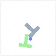

# 🅻 Letters Planar Pushing Dataset

Planar pushing is a fundamental robotic manipulation task that involves complex physical interactions and presents a rich benchmark for control learning. This dataset provides **8 distinct planar pushing environments**, each themed around a **different letter-shaped object**, with variations in **color**, **backgrounds**, and **visual distractions**.

We release **500 high-quality expert demonstrations per environment**, enabling training of robust visuomotor policies with limited supervision. These environments are an **augmented extension** of the `push-T` setup introduced in the [Diffusion Policy](https://arxiv.org/abs/2303.04137) paper, but with significantly increased diversity and control complexity.

This dataset is used in the ICLR 2025 paper:  
**[Control-Oriented Clustering of Visual Latent Representation](https://arxiv.org/abs/2410.05063)**  
We believe it can serve as a strong benchmark for future research in **behavior cloning**, **visual control**, and **representation learning**.


## 📦 What’s Included

- 8 pushing environments with letter-shaped objects (e.g., T, H, R, B, etc.)
- 500 expert demonstrations per environment
- Diverse visuals: varied colors, textures, lighting, and backgrounds
- Scripts to train and evaluate policies using Diffusion Models

## 🎥 Demo Videos

<table>
  <tr>
    <td></td>
    <td></td>
    <td></td>
    <td></td>
  </tr>

  <tr>
    <td></td>
    <td></td>
    <td></td>
    <td></td>
  </tr>
</table>


## 🚀 Quickstart

We provide example scripts to train and test a policy using diffusion models:

```bash
# Training with letter-shaped demos
python train_script.py

# Testing the trained model
python test_script.py
```

## 📒 Applications


This dataset is designed to support:


- **Behavior Cloning (e.g, Diffusion Policy)**
- **Continual Learning**
- **Study of Domain Adaptation**


Its **simplicity of usage** yet **rich visual variation** make it ideal for research investigations and algorithm benchmarking.


## Citation

If you find this dataset useful, please cite:

```bibtex
@inproceedings{qi25iclr-control,
title={Control-oriented Clustering of Visual Latent Representation},
author={Qi, Han and Yin, Haocheng and Yang, Heng},
booktitle={International Conference on Learning Representations (ICLR)},
year={2025},
note={\url{https://arxiv.org/abs/2410.05063}, \url{https://computationalrobotics.seas.harvard.edu/ControlOriented_NC/}}
}
```


## 🙌 Acknowledgements

Thanks to the authors of the Diffusion Policy paper for the original environment. Our extensions build upon their foundational work to support deeper investigations into visual control and representation geometry.